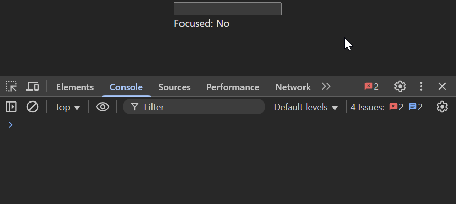

## HOC для отслеживания фокуса

---

### Цель  
Создать универсальный React HOC (Higher-Order Component), который добавляет к оборачиваемому компоненту функциональность отслеживания фокуса и потери фокуса (focus/blur) на уровне DOM-элемента, и предоставляет эту информацию через пропсы.

---

### Описание задачи  
HOC должен принимать React-компонент (как классовый, так и функциональный) и возвращать новый компонент, который:

- Отслеживает события фокуса (`focus`) и потери фокуса (`blur`) на корневом DOM-элементе, который рендерит оборачиваемый компонент.
- Передаёт в оборачиваемый компонент дополнительный проп `isFocused: boolean`, отражающий текущее состояние фокуса.
- Передаёт в оборачиваемый компонент два колбэка-пропа:
  - `onFocusChange?: (isFocused: boolean) => void` — вызывается при каждом изменении состояния фокуса.
  - `onFocus?: (event: React.FocusEvent) => void` — вызывается при событии `focus`.
  - `onBlur?: (event: React.FocusEvent) => void` — вызывается при событии `blur`.
- Корректно обрабатывает передачу и вызов исходных пропсов `onFocus` и `onBlur`, если они были переданы из родительского компонента.
- Сохраняет типизацию пропсов (TypeScript), расширяя их новыми пропсами, не ломая существующие.
- Поддерживает передачу `ref` к корневому DOM-элементу (используя `React.forwardRef`).
- Не влияет на визуальное отображение или поведение оборачиваемого компонента, кроме добавления функциональности отслеживания фокуса.
- Обеспечивает корректную очистку обработчиков событий при размонтировании.

---

### Требования к реализации

#### 1. API HOC

```typescript
function withFocusTracker<P>(
  WrappedComponent: React.ComponentType<P>
): React.ForwardRefExoticComponent<
  React.PropsWithoutRef<P & FocusTrackerInjectedProps> & React.RefAttributes<HTMLElement>
>;

interface FocusTrackerInjectedProps {
  isFocused: boolean;
  onFocusChange?: (isFocused: boolean) => void;
  onFocus?: (event: React.FocusEvent) => void;
  onBlur?: (event: React.FocusEvent) => void;
}
```

- `isFocused` — булево, отражает текущее состояние фокуса.
- `onFocusChange` — колбэк, вызывается с новым значением `isFocused` при каждом изменении.
- `onFocus` и `onBlur` — колбэки для событий фокуса и потери фокуса.
- HOC должен принимать и прокидывать все остальные пропсы без изменений.

#### 2. Отслеживание фокуса

- Использовать события React `onFocus` и `onBlur` (с учётом всплытия).
- Обновлять внутреннее состояние `isFocused` при получении/потере фокуса.
- Вызывать `onFocusChange` при изменении состояния.
- Вызывать `onFocus` и `onBlur` колбэки, если они переданы в пропсах.
- Если исходный компонент получил пропсы `onFocus` или `onBlur`, их тоже нужно корректно вызвать.

#### 3. Работа с ref

- HOC должен использовать `React.forwardRef` и передавать ref к корневому DOM-элементу.
- Если оборачиваемый компонент — функциональный без DOM-узла, можно обернуть его в `<div>` или `<span>`, который будет корневым элементом для отслеживания фокуса.
- Реф должен ссылаться именно на DOM-элемент, на котором отслеживаются события.

#### 4. Типизация

- Использовать TypeScript.
- Типы пропсов должны расширяться корректно, без конфликтов.
- Поддержка передачи ref с правильным типом (`HTMLElement` или более конкретным, если возможно).

#### 5. Тестирование

- Проверить, что `isFocused` меняется при фокусе и блюре.
- Проверить, что колбэки вызываются корректно.
- Проверить, что ref корректно прокидывается.
- Проверить, что визуальное отображение компонента не меняется.

---



### Пример использования

```ts
interface InputProps {
  value: string;
  onChange: (e: React.ChangeEvent<HTMLInputElement>) => void;
}

const Input = React.forwardRef<HTMLInputElement, InputProps>((props, ref) => (
  <input {...props} ref={ref} />
));

const InputWithFocusTracker = withFocusTracker(Input);

function App() {
  const [value, setValue] = React.useState('');
  const [focused, setFocused] = React.useState(false);

  return (
    <InputWithFocusTracker
      value={value}
      onChange={e => setValue(e.target.value)}
      onFocusChange={setFocused}
      onFocus={e => console.log('Focused')}
      onBlur={e => console.log('Blurred')}
    />
  );
}
```

### Структура проекта (пример)

```
src/
  hoc/
    withFocusTracker.tsx      // реализация HOC
  components/
    Input.tsx   // пример компонента, оборачиваемого withFocusTracker
  utils/
    composeEventHandlers.ts   // утилита для последовательного вызова нескольких обработчиков.
  App.tsx
  index.tsx
```

---

### Дополнительные рекомендации

- Используйте хуки (`useState`, `useCallback`, `useEffect`) для управления состоянием и обработчиками.
- Если оборачиваемый компонент не принимает `ref`, используйте контейнерный элемент для отслеживания фокуса.
- Обрабатывайте ситуации с вложенными элементами и всплытием событий.
- Добавьте описание и комментарии к коду.
