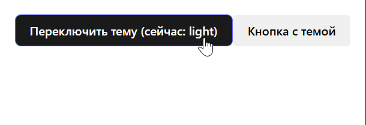

## HOC для управления темой

### Цель

Реализовать компонент высшего порядка (HOC) `withTheme`, который предоставляет оборачиваемому компоненту текущую тему оформления через пропсы. Управление темой и её переключение реализовать в родительском компоненте, который передаёт тему вниз через пропсы, без использования React Context API.

---

### Требования к функционалу

1. **HOC `withTheme`**

   - Принимает на вход React-компонент (функциональный или классовый).
   - Возвращает новый компонент, который:
     - Принимает проп `theme` (строка, например, `'light'` или `'dark'`).
     - Передаёт проп `theme` и остальные пропсы в оборачиваемый компонент.
   - Обеспечивает передачу актуального значения темы при изменении пропа `theme`.
   - Сохраняет имя исходного компонента для удобства отладки (`displayName`).
   - Опционально поддерживает `forwardRef`.

2. **Управление темой**

   - В родительском компоненте реализовать состояние `theme` с начальными значениями `'light'` или `'dark'`.
   - Добавить UI-элемент (например, кнопку или переключатель), который позволяет менять тему с `'light'` на `'dark'` и обратно.
   - Передавать текущее значение темы как проп `theme` в компонент, обёрнутый в `withTheme`.

3. **Применение темы**

   - Оборачиваемый компонент принимает проп `theme` и использует его для изменения стилей (цвет фона, цвет текста и т.п.).
   - При переключении темы стили компонента должны автоматически обновляться.

---



### Технические детали

- Все данные о теме передаются через пропсы сверху вниз.
- HOC должен быть типизирован на TypeScript.
- HOC должен сохранять имя исходного компонента (`displayName`).
- Оборачиваемый компонент должен принимать проп `theme` и остальные пропсы без изменений.

---

### Структура проекта (пример)

```
src/
  hoc/
    withTheme.tsx      // реализация HOC
  components/
    ThemedButton.tsx   // пример компонента, оборачиваемого withTheme
  App.tsx
  types.ts   // содержит тип ThemeType
  index.tsx
```

---

### Дополнительные рекомендации

- Для удобства можно определить тип темы как `type ThemeType = 'light' | 'dark';`.
- В родительском компоненте можно хранить объект с параметрами для каждой темы (цвета, стили).
- HOC просто прокидывает проп `theme` вниз — логика переключения и состояние темы в родителе.
- Можно реализовать поддержку `forwardRef` в HOC для удобства.
