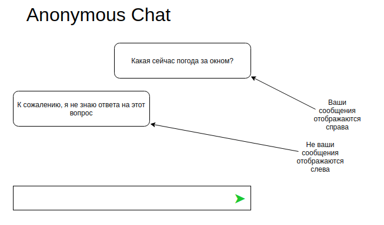

## Анонимный чат с постоянным идентификатором пользователя

---

### Цель  
Создать полностью анонимный чат, в который может отправлять сообщения любой пользователь, при этом обеспечив сохранение идентичности пользователя при работе в разных вкладках браузера.

---

### Описание задачи  
Реализуйте чат, где:  
- Все сообщения отправляются анонимно, но каждый пользователь имеет уникальный идентификатор `userId`, сохраняющийся между вкладками.  
- Сообщения загружаются с сервера периодически через HTTP GET-запросы с параметром `from`, указывающим последний полученный ID сообщения.  
- Пользователь может отправлять сообщения через форму, которые отправляются на сервер методом POST.  
- Сообщения отображаются в виде блоков с выравниванием: свои — справа, чужие — слева.

Бэкенд можно взять из каталога `backend`.



---

### Общая механика

#### 1. Идентификация пользователя  
- При первом заходе генерируется уникальный `userId` (например, с помощью `nanoid` или `uuid`).  
- Этот `userId` сохраняется в `localStorage` или `sessionStorage` для сохранения идентичности между вкладками и сессиями.  
- При отправке и получении сообщений используется этот идентификатор.

#### 2. Получение сообщений  
- При монтировании компонента запускается интервал или таймаут, который периодически выполняет GET-запрос:  
  ```
  GET http://localhost:7070/messages?from={lastMessageId}
  ```  
  где `lastMessageId` — ID последнего полученного сообщения (изначально 0).  
- Интервал опроса выбирается самостоятельно (например, каждые 2-5 секунд).  
- Сервер возвращает массив сообщений формата:  
  ```json
  [
    {
      "id": 1,
      "userId": "uuid-пользователя",
      "content": "Текст сообщения"
    },
    ...
  ]
  ```  
- Полученные сообщения добавляются к списку в состоянии.

#### 3. Отображение сообщений  
- Сообщения показываются в виде блоков:  
  - Сообщения с `userId`, совпадающим с вашим — выравниваются вправо.  
  - Остальные — влево.  
- Используйте цвет или стиль для визуального разграничения.

#### 4. Отправка сообщений  
- Пользователь вводит текст в форму и нажимает кнопку «Добавить».  
- Выполняется POST-запрос:  
  ```
  POST http://localhost:7070/messages
  Content-Type: application/json

  {
    "id": 0,
    "userId": "ваш userId",
    "content": "Текст из формы"
  }
  ```  
- После отправки сообщение не добавляется сразу, а ждёт обновления списка по интервалу.  
- Для улучшения UX подумайте, как показать отправляемое сообщение (например, временно отображать в списке с пометкой «отправляется»).

---

### Важные детали и рекомендации

- Храните `userId` в `localStorage` для сохранения между вкладками и сессиями.  
- Используйте библиотеку для генерации уникальных ID (`nanoid`, `uuid`).  
- Обрабатывайте ошибки сети и показывайте индикаторы загрузки или ошибки.  
- Для удобства пользователя реализуйте авто-скроллинг к последнему сообщению при обновлении списка.  
- Подумайте о безопасности: при такой схеме возможна подмена `userId` в запросах — рассмотрите способы минимизации рисков.  
- Подумайте, как сделать интерфейс комфортным при ожидании новых сообщений (например, индикатор «отправка...», отключение кнопки во время отправки).

---

### Спойлеры

<details>
  <summary>Как генерировать и хранить userId</summary>
  
  - При первом запуске приложения сгенерируйте `userId` с помощью `nanoid()` или `uuid()`.  
  - Сохраните его в `localStorage`:  
    ```js
    let userId = localStorage.getItem('userId');
    if (!userId) {
      userId = nanoid();
      localStorage.setItem('userId', userId);
    }
    ```  
  - Используйте этот `userId` для всех запросов отправки и для сравнения при отображении сообщений.
</details>

<details>
  <summary>Возможные уязвимости</summary>
  
  - Поскольку `userId` хранится на клиенте, злоумышленник может подменить его и отправлять сообщения от имени другого пользователя.  
  - Для минимизации рисков можно:  
    - Добавить серверную проверку по IP или сессии (если возможно).  
    - Ограничить частоту отправки сообщений.  
    - Использовать дополнительные механизмы аутентификации (если требуется).  
  - В рамках анонимного чата с простым бэкендом эти меры могут быть опциональными.
</details>

---

### Advanced (дополнительно)

1. Реализуйте раскрашивание сообщений разных пользователей в разные цвета для лучшей визуализации.  
2. Добавьте автопрокрутку чата к последнему сообщению при получении новых данных.

---

### Итог  
Данное задание позволит освоить работу с периодическим опросом сервера, хранением уникальных идентификаторов на клиенте, асинхронной отправкой и получением данных, а также организацией удобного и отзывчивого UI для анонимного чата.